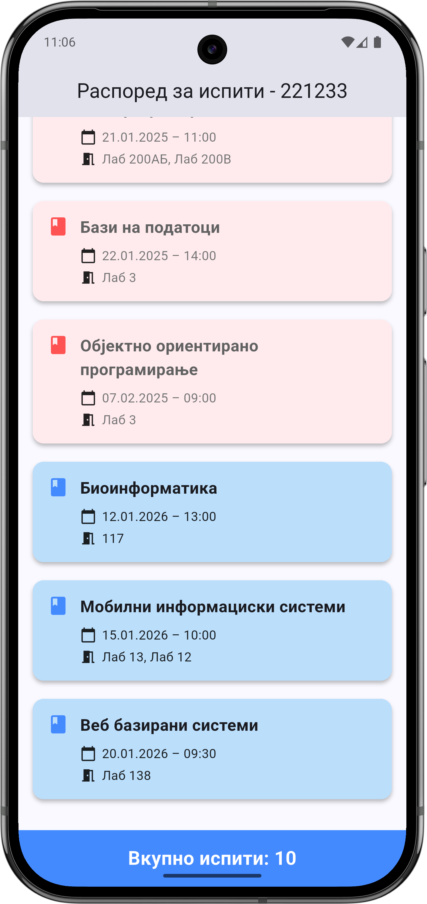
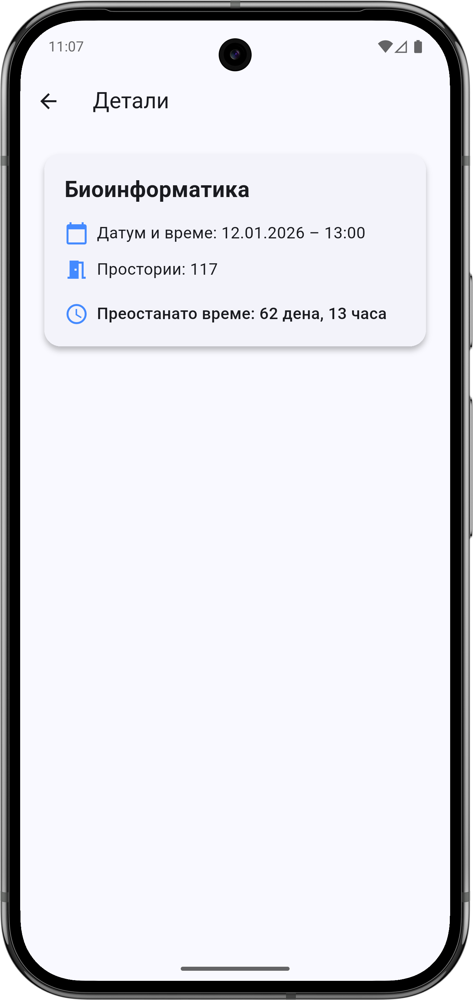

# Exam Schedule App

A simple Flutter mobile application that displays a schedule of exams, allowing students to quickly see exam details and countdowns.

## Features

- **Home Screen:** Shows a list of exams in chronological order using card widgets.
    - Each card displays: subject name, date & time, and rooms.
    - Past exams are visually distinguished from upcoming exams.
    - A badge at the bottom shows the total number of exams.
- **Exam Details:** Tap on a card to view detailed information about the exam.
    - Shows remaining time until the exam in the format `X дена, Y часа`.
    - If the exam has passed, the message is displayed in red.
- **Modern UI:** Full-width cards, clear icons for date and room, responsive layout.

## Screenshots

## Technologies

- **Flutter 3.35.7**
- **Dart**
- **Material Design 3**
- **intl** package for date formatting

## Getting Started

1. Clone the repository.
2. Run `flutter pub get` to install dependencies.
3. Launch the app using `flutter run` on your device or emulator.

---

